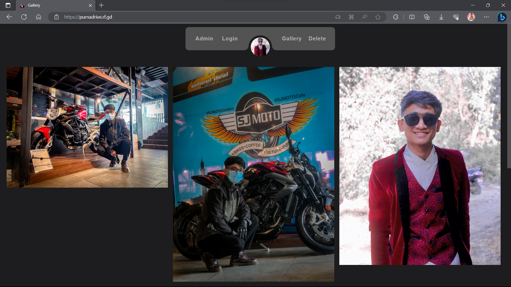
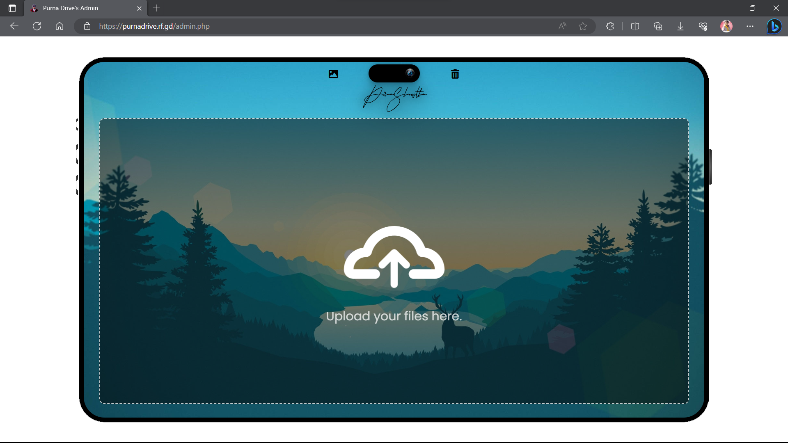

<h1><strong>PurnaDrive</strong> - share your real quality memories</h1>

<h2>
  <a href="https://purnadrive.rf.gd/">purnadrive.rf.gd</a>
</h2>

  
  
  
  
  

 

Welcome to PurnaDrive, a dynamic file sharing and management platform built using <strong>PHP</strong> and <strong>MySQL</strong>. PurnaDrive empowers you to effortlessly share and organize your files with a user-friendly interface, providing a comprehensive solution for your file management needs. Whether you're sharing documents, images, videos, or any other type of file, PurnaDrive makes it simple and efficient.

---

## Features 📋

⚡️ Upload files of various formats and sizes for easy sharing\
⚡️ Organize files into folders and categories for efficient management\
⚡️ Search for files using the built-in search bar\
⚡️ Download files with a single click\
⚡️ User authentication and authorization to ensure secure access\
⚡️ Responsive design for optimal performance on all devices\
⚡️ Intuitive user interface for seamless navigation and interaction\
⚡️ Real-time updates on file modifications and additions

## Pages 📚

✔️ Home/Index\
✔️ My Files\
✔️ Shared Files\
✔️ Favorites\
✔️ Gallery\
✔️ Delete Page\
✔️ Sign Up\
✔️ Log In\
✔️ Admin Panel

## Technologies Used 📚

`PHP` `MySQL` `HTML` `CSS` `JavaScript` `Bootstrap` `jQuery`

## Usage 🚀

To start using PurnaDrive, follow these steps:

1. Clone the repository.
2. Set up a local or remote web server (such as XAMPP, WAMP, or hosting provider).
3. Import the provided SQL database dump to set up the necessary database tables and data.
4. Configure the database connection in the relevant PHP files.
5. Start the web server and access the application in your web browser.
6. Register for an account or log in if you already have one.
7. Begin uploading, organizing, and sharing your files seamlessly.

⭐ Don't forget to give this repository a star on GitHub — your support is appreciated!
